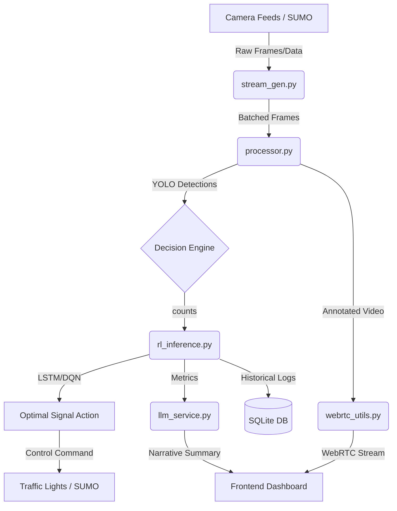

# Backend Overview - NeuroTraffic

## System Architecture







The NeuroTraffic Backend is a high-performance Python-based system built with FastAPI. It serves as the orchestrator for real-time traffic monitoring, AI-driven traffic signal control, and simulation management.

## Core Responsibilities

1.  **AI Inference**: Runs YOLOv8 models for real-time vehicle detection and counting across multiple camera feeds.
2.  **Traffic Control**: Uses Reinforcement Learning (DQN) and LSTM-based forecasting to optimize traffic light cycles.
3.  **Simulation Management**: Interfaces with the SUMO (Simulation of Urban MObility) engine to run virtual traffic scenarios and test RL policies.
4.  **WebRTC Streaming**: Provides low-latency, annotated video streams of traffic cameras to the frontend using `aiortc`.
5.  **Alerting & Emergency**: Monitors traffic for collisions, congestion, and emergency vehicles, triggering priority signal overrides when necessary.
6.  **Data Logging**: Stores historical traffic counts, signal schedules, and violations in a SQLite database for reporting and analysis.

## Key Components

- **`main.py`**: The FastAPI application entry point, defining all REST endpoints and WebRTC signaling logic.
- **`processor.py`**: Handles frame-by-frame processing, including YOLO inference, object tracking, and mask application.
- **`rl_inference.py`**: Contains the logic for the Reinforcement Learning controller and SUMO simulation manager.
- **`llm_service.py`**: Integrates with LLMs to generate natural language summaries of traffic conditions.
- **`database.py`**: Manages the SQLite database schema and provides CRUD operations for traffic logs.
- **`stream_gen.py`**: Manages video source ingestion and batching for the inference engine.
- **`alert_service.py`**: Implements the logic for detecting traffic incidents and managing emergency priority states.

## More Information

- [**ML Deep Dive (LSTM & DQN)**](./ml_deep_dive) - **Recommended for understanding the AI brain.**
- [**Project Glossary**](../GLOSSARY) - Definitions of all technical terms.

- **Framework**: FastAPI (Asynchronous Python)
- **ML/Inference**: YOLOv8 (Ultralytics), PyTorch, TensorRT (via `.engine` models)
- **Simulation**: SUMO (Simulation of Urban MObility)
- **WebRTC**: `aiortc`
- **Database**: SQLite
- **Environment**: Python 3.10+

```

```
